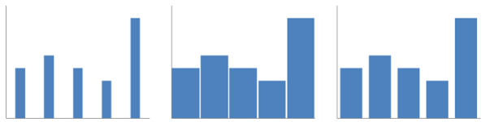
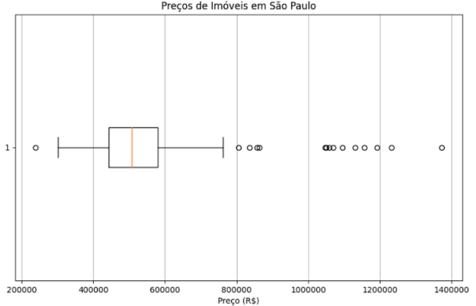
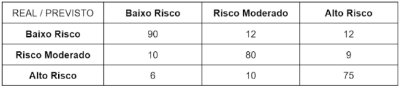

# Prova Módulo 3 (2024)

## Questões Objetivas

### Questão 1

Uma empresa de cosméticos lançou recentemente um aplicativo inovador que utiliza IA para identificar o tipo de cabelo do usuário (liso, ondulado, cacheado, crespo) e, com base nessa análise, fornecer recomendações personalizadas de produtos capilares. No entanto, usuárias começaram a relatar que o aplicativo estava apresentando resultados enviesados, favorecendo certos tipos de cabelo e negligenciando outros, especialmente cabelos crespos e cacheados, o que gerou grande insatisfação e críticas à empresa.

A partir da situação acima, analise quais dos procedimentos abaixo podem ter gerado vieses nos resultados do modelo desenvolvido pela empresa.

I. Os desenvolvedores utilizaram um conjunto de dados de treinamento equilibrados e representativos de todos os tipos de cabelo, garantindo que a IA aprendesse a identificar e classificar cada um deles com a mesma precisão.

II. O modelo foi treinado a partir dos feedbacks da maioria das usuárias. 

III. O modelo de IA foi treinado priorizando a identificação de tipos de cabelo mais comuns, como lisos e ondulados, em detrimento de tipos menos representados nos dados de treinamento, como crespos e cacheados.

IV. A base de dados utilizada para treinamento não foi adequada ao modelo de negócio da empresa.

Podem ter gerado vieses os procedimentos descritos nas afirmativas:

A) I, II e III, apenas. <br>
B) I e III, apenas. <br>
C) II, III e IV, apenas. <br>
D) II e IV, apenas. <br>
E) III e IV, apenas. <br>


### Questão 2

No Hospital Optimus Prime, uma equipe multidisciplinar está desenvolvendo um projeto de IA inovador para análise preditiva de riscos de doenças cardíacas em pacientes. Carlos, um cientista de dados é reconhecido por suas soluções originais e insights valiosos. No entanto, Carlos tem o hábito de se envolver profundamente no desenvolvimento de algoritmos complexos, muitas vezes negligenciando a documentação adequada de seu código. Essa situação tem gerado dificuldades para os outros membros da equipe, que precisam compreender e dar continuidade ao seu trabalho, impactando o ritmo do projeto.

Considerando a situação acima, assinale a alternativa que descreve um feedback eficaz que o líder da equipe poderia dar ao Carlos, usando corretamente a técnica SCI.

A) "Carlos, seu trabalho é extremamente valioso para nós, mas seria ainda mais eficaz se você seguisse as diretrizes de documentação da empresa. Como isso não tem ocorrido, fica mais complicado para nós mantermos a qualidade do projeto." <br>
B) "Carlos, sua habilidade para inovação em IA é algo raro, mas quero que você entenda que a ausência de documentação em seu código será um ponto negativo em sua próxima avaliação de desempenho. Isso é algo que precisa ser corrigido imediatamente."  <br>
C) "Carlos, eu entendo que você está muito ocupado nos últimos 2 meses, desenvolvendo soluções para o projeto de IA, mas é crucial documentar seu código. Sei que é <br>
tedioso, mas sem isso, fica difícil para mim e para a equipe acompanhar o que você está fazendo." 
D) "Carlos, notei três vezes na sprint passada que você não documentou o seu código. Por conta disso, o restante da equipe está tendo dificuldade em entender suas soluções, o que diminui nossa eficiência. O que você acha de planejarmos uma sessão de revisão para melhorar esse aspecto?" <br>
E) "Carlos, suas habilidades são impressionantes, mas a falta de documentação é um problema. A equipe perdeu tempo tentando entender seu modelo, atrasando o projeto. A documentação completa será obrigatória a partir de agora, ou medidas disciplinares serão tomadas." <br>


### Questão 3

No contexto da governança corporativa, existem duas abordagens mais utilizadas: a stakeholder oriented e a shareholder oriented. Ambas as abordagens buscam garantir o sucesso da empresa a longo prazo, mas diferem na forma como consideram os diversos grupos de interesse. 

Sobre essas abordagens, analise as afirmativas a seguir: 

I. A abordagem stakeholder oriented, ao considerar os interesses de todos os grupos de interesse, pode contribuir para a construção de uma reputação positiva da empresa e para a criação de valor de longo prazo. No entanto, essa abordagem pode tornar a tomada de decisão mais complexa, uma vez que precisa equilibrar interesses muitas vezes conflitantes. 

PORQUE 

II. A abordagem shareholder oriented, por sua vez, prioriza os interesses dos acionistas, buscando maximizar o retorno sobre o investimento. Embora essa abordagem possa simplificar a tomada de decisão, ela pode levar a uma visão de curto prazo e negligenciar os impactos sociais e ambientais das atividades da empresa. 

Assinale a alternativa correta: 

A) As duas afirmações são verdadeiras, e a segunda justifica a primeira.  <br>
B) As duas afirmações são verdadeiras, mas a segunda não justifica a primeira  <br>
C) A primeira afirmação é verdadeira, e a segunda é falsa.  <br>
D) A primeira afirmação é falsa, e a segunda é verdadeira.  <br>
E) Ambas as afirmações são falsas.  <br>


### Questão 4

A Lei Geral de Proteção de Dados Pessoais (LGPD), Lei nº 13.709/2018, estabelece regras sobre a coleta, armazenamento, tratamento e compartilhamento de dados pessoais, impondo mais proteção e penalidades para o não cumprimento. A lei se aplica a todas as empresas que operam no Brasil e tratam dados pessoais de indivíduos no país, independentemente do local onde a empresa está sediada. A LGPD define dados pessoais como informações relacionadas a uma pessoa natural identificada ou identificável e estabelece princípios como o da finalidade, adequação, necessidade, livre acesso, qualidade dos dados, transparência, segurança, prevenção, não discriminação e responsabilização e prestação de contas.  <br>

Considerando as disposições da Lei Geral de Proteção de Dados (LGPD), avalie as afirmações a seguir. 

I. A LGPD se aplica apenas a empresas sediadas no Brasil.  

II. A LGPD define dados pessoais como informações relacionadas a uma pessoa natural identificada ou identificável.  

III. Um dos princípios da LGPD é a transparência, que garante aos titulares dos dados acesso claro e completo sobre como seus dados estão sendo utilizados.  

IV. A LGPD permite o tratamento de dados pessoais sem o consentimento do titular em qualquer situação. 

Assinale a alternativa correta.

A) Apenas a afirmação I está correta.  <br>
B) Apenas a afirmação II está correta.  <br>
C) Apenas a afirmação III está correta.  <br>
D) Apenas as afirmações II e III estão corretas. <br>
E) Apenas as afirmações I e IV estão corretas.  <br>


### Questão 5

Uma determinada empresa é líder no setor de tecnologia, reconhecida por seus produtos inovadores e ambiente de trabalho aberto e colaborativo. Recentemente, o conselho de administração nomeou uma nova CEO, com a missão de expandir a empresa em mercados internacionais. 

Sob essa nova liderança, várias mudanças foram implementadas: 

- O layout do escritório foi redesenhado para incluir escritórios privados em vez de espaços abertos. 
- Foi introduzido um código de vestimenta formal, substituindo o traje casual anteriormente adotado. 
- A gestão enfatizou a importância da hierarquia e de linhas formais de reporte.
- As comunicações oficiais da empresa passaram a destacar a eficiência e a lucratividade como principais prioridades. 

Por conta dessas medidas, alguns funcionários começaram a sentir que a empresa estava perdendo seu espírito inovador e sua cultura colaborativa. 

Com base no cenário acima, qual das seguintes afirmações identifica corretamente os níveis da cultura organizacional afetados, de acordo com o modelo de Edgar Schein? 

A) A introdução de um código de vestimenta formal é um exemplo de mudança nos pressupostos básicos, pois altera as crenças fundamentais dos funcionários sobre a cultura da empresa.  <br>
B) A ênfase na eficiência e lucratividade nas comunicações reflete uma mudança nos artefatos, já que altera as estruturas organizacionais visíveis.  <br>
C) O redesenho do layout do escritório para incluir escritórios privados impacta os valores, modificando os princípios declarados da empresa.  <br>
D) O foco da gestão na hierarquia e em linhas formais de reporte indica uma mudança nos valores, refletindo uma alteração nas normas e estratégias compartilhadas da  <br>
organização. 
E) Os funcionários, sentindo a perda do espírito inovador, demonstram uma mudança nos artefatos, pois afeta as respostas emocionais visíveis.  <br>


### Questão 6

Um método muito utilizado no design de experiência do usuário (UX) é o mapa de jornada do usuário, uma ferramenta visual que descreve a experiência do cliente ao interagir com um produto ou serviço. O objetivo principal do mapa de jornada é identificar oportunidades de melhoria no produto ou serviço, proporcionando uma experiência mais fluida e satisfatória para o usuário. A criação desse mapa envolve, idealmente, a coleta de dados qualitativos, como entrevistas e observação, para entender as necessidades, dores e expectativas do usuário em diferentes etapas de sua jornada. 

Considere que uma empresa de tecnologia deseja melhorar a experiência de seus usuários ao utilizarem seu aplicativo de serviços financeiros. Para isso, a equipe de UX propôs a criação de um mapa de jornada do usuário. O processo envolveu a observação do comportamento dos usuários ao longo do tempo, com foco nos pontos de maior frustração e satisfação durante o uso do aplicativo. Com o mapa finalizado, a equipe pretende usar as informações obtidas para aprimorar as funcionalidades e a interface do aplicativo. 

Com base no contexto, assinale a alternativa INCORRETA sobre o mapa de jornada do usuário: 

A) O mapa de jornada do usuário pode ajudar a identificar os principais pontos de atrito enfrentados pelo usuário durante a interação com o produto.  <br>
B) A coleta de dados para o mapa de jornada do usuário pode incluir métodos quantitativos e qualitativos, como pesquisas e entrevistas em profundidade.  <br>
C) O mapa de jornada do usuário trabalha nos aspectos técnicos da interface, desconsiderando as expectativas dos usuários durante a interação.  <br>
D) A criação de um mapa de jornada auxilia a equipe de UX a entender melhor a perspectiva do usuário, possibilitando o desenvolvimento de soluções mais alinhadas com suas necessidades.  <br>
E) O mapa de jornada do usuário permite que a empresa visualize toda a trajetória do usuário ao interagir com o produto, desde o primeiro contato até o pós-uso <br>


### Questão 7

Você está utilizando um novo programa para te ajudar em suas tarefas diárias. Entre essas tarefas, estava a de gerar gráficos para analisar o conjunto de animais que você e seus amigos fotografaram durante a última visita ao zoológico (pássaros, girafas e peixes). Após selecionar algumas imagens, você as inseriu no programa, e gerou os gráficos que estão representados na figura a seguir. Avalie as afirmações e assinale a alternativa que não contém erros. 

A) O gráfico das girafas é do tipo “gráfico de barras”. Os eixos desse gráfico são “altura x posição”, diferenciando com clareza as três diferentes categorias de altura demonstradas na imagem (girafas pequenas, médias e grandes).  <br>
B) Os três gráficos são adequados para representar as diferenças entre as quantidades de cada tipo de animal nos conjuntos fotografados.  <br>
C) O gráfico dos pássaros é do tipo “gráfico de linha”. Esse gráfico, de eixos “posição x tempo", registra a tendência de voo de cada pássaro em diferentes momentos,
demonstrando uma subida e depois uma descida. O eixo vertical representa a posição do pássaro, enquanto o eixo horizontal registra seu tempo de voo. <br>
D) O gráfico dos peixes é do tipo “gráfico de dispersão”. Esse gráfico (posição vertical x posição horizontal) demonstra a distribuição dos peixes de diferentes cores no aquário. <br>
E) Nenhum dos gráficos é adequado para representar características sobre os animais fotografados. O programa traçou formas geométricas por cima das identificações de animais nas imagens, não extraindo nenhuma característica verídica para análise.  <br>


### Questão 8

A largura das barras em um gráfico de barras é uma decisão importante no design de visualizações de dados. Segundo Alex Velez, do blog Storytelling With Data, há uma convenção visual importante relacionada a essa largura que é capaz de distinguir bem o que é um gráfico de barras e o que é um histograma. 
(Disponível em: https://www.storytellingwithdata.com/blog/2021/1/28/histogramsand-bar-charts) 

A imagem abaixo ilustra três exemplos de gráficos de barras com diferentes larguras. Considere as afirmações a respeito das larguras das barras a seguir e julgue quais são verdadeiras e falsas.

I. Barras muito finas podem fazer com que os dados pareçam dispersos e podem dificultar a visualização e comparação dos valores representados. 

II. Barras muito grossas tornam o gráfico menos eficiente, pois o excesso de preenchimento entre as barras pode dificultar a distinção de categorias. 

III. Uma largura que seja maior do que o espaçamento entre as barras, mas não muito grossa, pode ser considerada uma boa medida, pois permite um destaque mais adequado a cada categoria e maior facilidade de comparação. 

IV. A largura das barras não influencia a leitura dos valores, pois tais larguras apenas comprometem a diferenciação das categorias, sem afetar a comparação de alturas.

<br>
<div align="center"> 
    
</div>
<br>

A) Somente as proposições I, II e III são verdadeiras.  <br>
B) Somente as proposições II, III e IV são verdadeiras.  <br>
C) Somente as proposições I e II são verdadeiras.  <br>
D) Somente a proposição IV é verdadeira.  <br>
E) Todas as proposições são falsas. <br>

### Questão 9

A distribuição normal é relevante em modelos preditivos porque muitos fenômenos naturais e sociais seguem essa distribuição, permitindo simplificar a análise e fazer previsões precisas. Além disso, a distribuição normal facilita a aplicação de técnicas estatísticas, como intervalos de confiança e testes de hipótese, que são fundamentais para validar e interpretar modelos. 

Suponha que você está desenvolvendo um modelo preditivo para uma companhia energética que deseja prever o consumo de gás de seus clientes. A previsão do consumo é importante para que a empresa possa planejar a compra e distribuição de gás, otimizando seus custos operacionais e garantindo o fornecimento adequado, especialmente em períodos de alta demanda.

Neste contexto, julgue as afirmações a seguir: 

I - Assumindo que o consumo de gás de um cliente siga uma distribuição normal, com média e o desvio padrão conhecidos, é possível determinar a probabilidade de que o consumo mensal deste cliente esteja dentro de uma faixa de valores préespecificada.  

II - A distribuição normal pode ser aplicada para modelar o consumo de gás tanto de clientes industriais quanto de clientes residenciais, sendo necessário, contudo, o ajuste dos parâmetros de média e desvio padrão. 

III - A média, a mediana e a moda dos dados de consumo de gás serão diferentes se esses dados seguirem uma distribuição normal. 

IV - Ao aplicar a distribuição normal para prever o consumo de gás, espera-se que o consumo da maior parte dos clientes esteja em faixas de valores próximos à média. 

Estão corretas, apenas: 

A) I e III  <br>
B) II e IV  <br>
C) I, II, IV  <br>
D) II, III, IV  <br>
E) I, II, III, IV <br>

### Questão 10

Intervalos de confiança fornecem uma faixa na qual a verdadeira medida ou parâmetro da população provavelmente se encontra, quantificando a incerteza associada às estimativas amostrais. Eles ajudam na tomada de decisões informadas e na comunicação clara dos resultados, mostrando a precisão e a confiabilidade das estimativas. 

Suponha que você está desenvolvendo um modelo preditivo para prever o desempenho de um time de futebol com base em várias métricas, como posse de bola, número de finalizações, e desempenho físico dos jogadores. Para testar o modelo, você analisa o desempenho médio de 48 jogos, obtendo uma média de 1,8 gols por jogo, com um desvio padrão de 0,6 gols. Considerando um nível de confiança de 95%, qual é o intervalo de confiança para a média de gols por jogo? 

É permitido usar a calculadora. 

Dados: 

P(Z<1,28) = 0,90  <br>
P(Z<1,65) = 0,95  <br>
P(Z<1,96) = 0,975 <br>
P(Z<2,33) = 0,99  <br>


A) [1,20; 2,40] <br>
B) [1,60; 2,00] <br>
C) [1,63; 1,97] <br>
D) [1,66; 1,94] <br>
E) [1,74; 1,86] <br>

### Questão 11

Um modelo preditivo é utilizado para avaliar a qualidade do ar em uma região urbana, levando em consideração a concentração de dióxido de nitrogênio (NO2) em um volume tridimensional. A concentração de NO2 é representada por uma função C(x,y,z), onde x, y e z são as coordenadas espaciais. Para determinar a quantidade total de NO2 na região, utiliza-se a integral tripla de C(x,y,z) sobre o volume V da região. 

Sobre a aplicação da integral tripla no contexto de modelos de predição, analise as afirmações abaixo: 

I. A integral tripla permite calcular a quantidade total de NO2 em toda a região tridimensional considerada pelo modelo preditivo. 

II. A integral tripla é independente da função C(x,y,z), ou seja, basta apenas definir corretamente os limites de integração. 

III. Se a função C(x,y,z) for constante em toda a região, a integral tripla será equivalente ao volume da região multiplicado por essa constante. 

IV. A integral tripla pode ser usada para calcular a taxa de variação instantânea da concentração de NO2 em relação ao tempo em uma determinada região. 

Com base nas asserções acima, é correto o que se afirma em: 

A) apenas, I, II e III.  <br>
B) apenas, I e III.  <br>
C) apenas, I.  <br>
D) apenas III e IV.  <br>
E) apenas I e IV.  <br>

### Questão 12

A redução de dimensionalidade por meio de técnicas de análise multivariada, como PCA (Análise de Componentes Principais) é uma das aplicações diretas de autovalores e autovetores. Durante o processo, a matriz de covariância dos dados é analisada para determinar as direções principais de variabilidade no conjunto de dados. Essas direções são dadas pelos autovetores da matriz de covariância, e os autovalores correspondentes indicam a quantidade de variabilidade capturada em cada direção. 

Considere um exemplo simples com duas variáveis. O conjunto de dados coletados apresenta matriz de covariância dada por: 

Cov(X,Y) = { ( 4 1 ); (2 3) } 

Para simplificar a notação, os números entre parênteses representam as linhas. O ponto e vírgula separa as duas linhas. A matriz acima tem duas linhas, sendo a primeira com os números 4 e 1 e a segunda linha com os números 2 e 3. 

Com base na matriz Cov(X, Y), avalie as afirmações abaixo:

I. A matriz possui dois autovalores reais e positivos.

II. A direção (1 1) representa o autovetor associado ao autovalor igual a 2.

III. A matriz Cov(X, Y) não possui autovalores reais.

IV. Os maiores autovalores correspondem às direções com maior variabilidade, que são as componentes principais mais importantes.

Com base nas afirmações acima, é correto o que se afirma em: 

A) apenas, I, II e IV.  <br>
B) apenas, II e IV.  <br>
C) apenas, III e IV.  <br>
D) apenas, I.  <br>
E) apenas, I e IV.  <br>

### Questão 13

Uma equipe de cientistas de dados está conduzindo um estudo sobre a eficiência da logística reversa de produtos recicláveis no Brasil. Eles têm um conjunto de dados em um arquivo CSV, logistica_reversa.csv, que contém as seguintes colunas: 

- produto: o tipo de produto (por exemplo, "Pilhas", "Baterias", "Pneus", etc.) 
- quantidade_retornada: a quantidade de produtos devolvidos em um determinado ano 
- ano: o ano da devolução
- estado: o estado brasileiro onde os produtos foram coletados

Na imagem, consta um dos scripts implementados pela equipe para análise dos dados em Python. 

Assinale a alternativa correta.

```py
import pandas as pd

# Leitura dos dados 
df = pd.read_csv('logistica_reversa.csv')

# Filtrando os dados para os anos de 2020 e 2021
df_filtrado = df[(df['ano'] == 2020) | (df['ano'] == 2021)]

# Agrupando por produto e calculando a média da quantidade retornada
media_retornada = df_filtrado.groupby('produto')['quantidade_retornada'].mean()

print(media_retornada)
```

A) O código calcula a média de devoluções por estado em 2020 e 2021. <br>
B) O código filtra os dados de 2020 e 2021 e calcula a média por produto, sem considerar
estado. <br>
C) O código filtra os dados de 2020 e 2021 e calcula a soma das devoluções por produto, sem
considerar estado. <br>
D) O código exibe a soma total de produtos devolvidos em 2020 e 2021, agrupando por
produto e por estado. <br>
E) O código está incorreto, pois mean() não pode ser usado com groupby(). <br>

### Questão 14

Uma empresa de análise de mercado imobiliário está avaliando a variação nos preços de imóveis em São Paulo com o objetivo de entender a distribuição dos valores. Para isso, foi gerado um boxplot que revela informações importantes sobre o comportamento dos preços, incluindo a presença de outliers, ou seja,
valores que se destacam por estarem muito acima ou abaixo da maioria dos dados.

Com base no boxplot presente na imagem, qual das alternativas a seguir descreve corretamente os outliers no conjunto de dados?

<br>
<div align="center"> 
    
</div>
<br>

A) Existem outliers com preços de imóveis abaixo de R$ 400.000,00 e acima de R$ 1.000.000,00, indicando que alguns imóveis têm preços significativamente diferentes da maioria. <br>
B) Não há outliers no conjunto de dados, todos os preços estão dentro do intervalo esperado. <br>
C) Apenas os imóveis com preços acima de R$ 1.200.000,00 são considerados outliers, o que significa que os imóveis mais caros são os únicos fora do padrão. <br>
D) Todos os preços estão concentrados dentro do intervalo interquartil, sem a presença de outliers. <br>
E) Os imóveis com preços inferiores a R$ 600.000,00 são considerados outliers, uma vez que a maioria dos valores está acima dessa faixa. <br>

### Questão 15

Logo após concluírem o Módulo 3, os alunos das turmas T11 a T14 decidiram fazer a semana de Machine Learning do Inteli, com diversas rodas de discussão. Uma das dinâmicas envolveu o tópico “maldição da dimensionalidade”, que contou com a apresentação de três alunos: Ana, Bia e Carlos. Como um bom observador, você anotou as falas que mais chamaram a sua atenção:

I - “Existe um fenômeno que mostra que à medida que o número de características (features) aumenta, o desempenho do classificador tende a aumentar, até atingir o número ideal de características. A partir deste ponto, adicionar mais características com base no mesmo tamanho do conjunto de treinamento degradará o desempenho do classificador.” - Ana 

II - “Adicionar mais características significa aumentar as dimensões dos dados. Quanto mais dimensões, pior será o desempenho computacional do modelo. Mas há situações em que o aumento do número de características, com valores nãonulos, causa uma redução na distância euclidiana (em linha reta) entre os pontos no espaço de características." - Bia 

III - “O KNN (k-Nearest Neighbors) é muito suscetível ao overfitting devido à maldição da dimensionalidade, uma vez que o espaço de características se torna cada vez mais esparso à medida que o número de dimensões aumenta.” - Carlos  

São afirmações corretas:

A) Somente I e II.  <br>
B) Somente I e III.  <br>
C) Somente II.  <br>
D) Somente II e III.  <br>
E) Somente III.  <br>

### Questão 16

A detecção de fraudes em transações bancárias é um dos principais problemas enfrentados por instituições financeiras. Com o aumento do volume de transações digitais, identificar comportamentos fraudulentos em meio a milhões de transações legítimas é uma tarefa cada vez mais complexa e desafiadora. Modelos de aprendizado de máquina podem ser empregados para automatizar esse processo, analisando padrões em dados históricos e sinalizando atividades suspeitas. 

Considerando um cenário com duas classes (“Fraude” vs “Não Fraude”), analise as afirmações a seguir e assinale a alternativa INCORRETA: 

A) A precisão é uma medida que indica quantas das transações identificadas como fraudulentas são realmente fraudes. Em um cenário hipotético, se o modelo classifica 100 transações como fraudulentas e 80 delas realmente são fraudes, a precisão será de 80%  <br>
B) A revocação (recall) é uma medida que indica quantas fraudes reais o sistema conseguiu identificar. Em um cenário hipotético com 200 transações fraudulentas ao todo, mas considerando que o sistema só detecta 80 dessas fraudes, a revocação será de 40%  <br>
C) Considerando a classe “Fraude” como a classe positiva, um falso negativo ocorre quando o modelo aponta uma transação fraudulenta como “Não Fraude”  <br>
D) É possível criar um modelo com precisão alta para classificar fraudes, mas ao mesmo tempo com baixa revocação (recall)  <br>
E) O F1-score é uma medida que prioriza a precisão do modelo, dando maior peso a essa métrica em relação à revocação (recall) <br>

### Questão 17

Na região central do Brasil uma rede de supermercados deseja segmentar seus clientes com base em padrões de compra, a fim de otimizar campanhas de marketing e programas de fidelidade. A equipe de ciência de dados decidiu utilizar o algoritmo K-Means para agrupar os clientes com base em suas características de consumo, como frequência de compra, valor médio gasto e categorias de produtos adquiridos. Eles utilizaram métodos como o elbow plot e o score de silhueta para ajudar na escolha do número adequado de clusters. 

Considere as seguintes afirmações sobre o uso de K-Means, o elbow plot e o score de silhueta no contexto de varejo: 

I. No K-Means, o elbow plot é utilizado para determinar o número ideal de clusters ao identificar o ponto onde a redução na soma dos erros quadrados intra-cluster começa a diminuir, indicando um possível número ideal de grupos.  

II. O score de silhueta próximo de 1 indica que os grupos estão bem definidos, sugerindo que os clientes dentro de cada cluster possuem padrões de compra semelhantes e estão bem separados dos demais clusters.  

III. O K-Means é sempre eficaz para segmentar clientes, mesmo quando os dados apresentam formas não esféricas ou tamanhos de cluster muito desiguais.  

IV. A escolha do número de clusters impacta diretamente a qualidade dos agrupamentos e métodos como o elbow plot e o score de silhueta são utilizados para melhorar essa escolha.  

Quais das afirmações acima estão corretas?

A) I e II.  <br>
B) I, II e IV.  <br>
C) II e III.  <br>
D) III e IV.  <br>
E) Todas as afirmações estão corretas.  <br>

### Questão 18

Uma clínica de saúde no Brasil deseja prever o risco de desenvolvimento de doenças cardíacas em seus pacientes com base em fatores como idade, pressão arterial, colesterol e histórico familiar. A equipe de ciência de dados da clínica decidiu utilizar o algoritmo KNN (K-Nearest Neighbors) para classificar os pacientes como de baixo ou alto risco. Eles ajustaram o valor de K e testaram diferentes métricas de distância, como Euclidiana e Manhattan, para encontrar a melhor configuração. 

Considere as seguintes afirmações sobre o uso do KNN, a escolha do valor de K e a métrica de distância no contexto de saúde: 

I. No KNN, o valor de K indica quantos pacientes similares (com base em fatores como pressão arterial e colesterol) são considerados para prever o risco de doenças cardíacas de um novo paciente. Um valor de K muito pequeno pode resultar em um modelo muito sensível a ruídos nos dados, enquanto um valor muito grande pode reduzir a precisão da previsão. 

II. A métrica de distância Euclidiana sempre será a melhor escolha no KNN quando se trata de dados médicos, pois reflete diretamente as diferenças absolutas entre variáveis como idade e colesterol. 

III. O KNN pode ser utilizado tanto para classificação (como prever se um paciente tem alto ou baixo risco de doenças cardíacas) quanto para regressão (como prever o valor exato da pressão arterial de um paciente). IV. A escolha do valor de K e da métrica de distância é crucial para garantir a eficácia do modelo, e a validação cruzada é frequentemente utilizada para otimizar esses parâmetros no contexto de dados médicos. 

Quais das afirmações acima estão corretas? 

A) I e IV.  <br>
B) I, III e IV.  <br>
C) II e IV.  <br>
D) III e IV.  <br>
E) Todas as afirmações estão corretas. <br>

### Questão 19

Em um projeto de análise imobiliária, Mariana e Paulo estão trabalhando para prever o preço de apartamentos com base em várias características, como metragem quadrada, número de quartos e proximidade ao centro da cidade. Eles decidem usar um modelo de regressão linear simples, em que a variável dependente é o preço do apartamento, e a variável independente é a metragem quadrada. Mariana faz a seguinte observação: 

"Se aumentarmos a metragem quadrada em 20 metros quadrados, o modelo prevê que o preço do apartamento aumentará em R$80.000, mantendo todas as outras variáveis constantes." 

Com base no contexto apresentado, o que a declaração de Mariana revela sobre o coeficiente da variável "metragem quadrada" no modelo de regressão linear? 

A) O coeficiente da variável "metragem quadrada" é -4.000, indicando uma relação negativa entre a metragem e o preço do apartamento. <br>
B) O coeficiente da variável "metragem quadrada" é 0, sugerindo que a metragem quadrada não tem efeito sobre o preço do apartamento. <br>
C) O coeficiente da variável "metragem quadrada" é 20, o que significa que para cada aumento de R$20.000 no preço do apartamento, a metragem quadrada aumenta em 20 metros quadrados. <br>
D) O coeficiente da variável "metragem quadrada" é 4.000, o que significa que para cada metro quadrado a mais, o preço do apartamento aumenta em R$4.000. <br>
E) O coeficiente da variável "metragem quadrada" é 80.000, indicando que um aumento de 20 metros quadrados resultará em um aumento de R$80.000 no preço do apartamento. <br>

### Questão 20

Uma empresa de diagnósticos médicos está desenvolvendo um modelo de classificação para prever doenças com base em exames laboratoriais. O modelo classifica pacientes em três categorias de risco para uma doença: "Baixo Risco", "Risco Moderado" e "Alto Risco". Após testar o modelo em um conjunto de dados de validação com 304 pacientes, a equipe responsável construiu uma matriz de confusão conforme imagem abaixo, que representa os resultados das previsões em comparação com os diagnósticos reais dos médicos. 

Considerando os dados apresentados, assinale a alternativa INCORRETA. 

<br>
<div align="center"> 
    
</div>
<br>

A) A classe “Alto Risco” apresentou menos falsos negativos do que falsos positivos. <br>
B) O modelo classificou corretamente mais de 240 pacientes. <br>
C) A classe "Risco Moderado" apresentou o maior número de falsos positivos entre todas as classes. <br>
D) O número de pacientes classificados incorretamente como "Baixo Risco" é menor que o número de pacientes classificados incorretamente como "Alto Risco". <br>
E) A classe "Baixo Risco" apresentou mais falsos positivos do que falsos negativos. <br>

## Questões Dissertativas

### Questão 21

Suponha que você está desenvolvendo um modelo preditivo para estimar a audiência de um programa de televisão. Com base em dados históricos, você sabe que a audiência média de programas semelhantes é de 1,20 milhões de telespectadores. Você coleta uma amostra de 40 episódios recentes do programa e obtém uma média de audiência de 1,30 milhões de telespectadores, com um desvio padrão de 0,35 milhões de telespectadores. 

Teste a hipótese de que a média de audiência dos episódios recentes é significativamente maior que a média histórica de 1,2 milhões de telespectadores. Utilize um nível de significância de 5%. Note o termo "maior que" na hipótese, o que ajudará você a definir se o teste é unicaudal ou bicaudal. 

Como você está resolvendo usando o computador, não precisa enunciar a hipótese nula e a alternativa. Você precisa fazer isso para resolver o problema, mas não precisa escrevê-las na resposta. 

Responda às seguintes questões (o problema é um só, as questões são para orientar sua resposta). É permitido usar a calculadora. 

a) Calcule o valor do teste Z para a diferença entre a média amostral e a média histórica. Apresente os cálculos. <br>
b) Determine o valor crítico Z para um nível de significância de 5%. <br>
c) Compare o valor do teste Z com o valor crítico e enuncie a conclusão do teste, dizendo se a hipótese nula deve ser rejeitada ou não. <br>

Dados: 

P(Z<1,28) = 0,90 <br>
P(Z<1,65) = 0,95 <br>
P(Z<1,96) = 0,975 <br>
P(Z<2,33) = 0,99 <br>

### Questão 22

O cálculo diferencial, especialmente para funções de várias variáveis, pode ser utilizado na construção de modelos preditivos. Em geral, os modelos dependem de uma ampla gama de dados de entrada, onde cada variável pode influenciar de maneira distinta o resultado. Ao utilizar funções de várias variáveis, é possível capturar as interações e dependências entre essas variáveis, permitindo que o modelo faça previsões mais precisas e robustas. 

Considere que o custo de uma apólice de seguro (C, em reais) depende de dois fatores: tempo de habilitação (t, em anos) e valor do veículo (v, em milhares de reais). Para o modelo, considere: 

C(t,v) = 500 + (2000 / (t + 1)) + 20 v 

Vamos considerar o tempo de habilitação como variável contínua. Baseado no modelo acima, determine: 

a) Custo da apólice de seguro para o carro de valor igual a R$ 100.000,00 de um condutor recém habilitado (t = 1 ano). <br>
b) Determine a taxa de variação do custo da apólice de seguro em relação ao tempo de habilitação, ou seja, determine a derivada parcial de C(t,v) em relação a t. <br>
c) Determine a taxa de variação do custo da apólice de seguro em relação ao valor do veículo, ou seja, determine a derivada parcial de C(t,v) em relação a v. <br>
d) Calcule as taxas de variação do custo da apólice em relação a t e v para um segurado de 9 anos de tempo de habilitação e carro de R$ 200.000,00. <br>


### Questão 23

Você foi recentemente aprovado para um estágio em uma empresa de tecnologia, onde está participando de um projeto que visa classificar e-mails como spam ou não spam utilizando dados de conteúdo, como palavras-chave, remetente e horário de envio. Para resolver esse problema, você decidiu utilizar o algoritmo Naive Bayes. 

Após treinar o modelo, você percebe que a acurácia no conjunto de treinamento é de 100%, mas a acurácia no conjunto de teste é significativamente inferior. Seu supervisor pediu que você revisasse o modelo para melhorar a capacidade de predição em novos dados. 

Com base nesse cenário, responda às seguintes perguntas: 

1. O que é acurácia em um modelo de classificação? Explique o que significa uma acurácia de 100% no conjunto de treinamento. 
2. Qual a diferença entre a acurácia no conjunto de treinamento e a acurácia no conjunto de teste? 
3. Qual é o problema que pode ocorrer ao obter uma acurácia de 100% no conjunto de treinamento com Naive Bayes? Explique como você chegou a essa conclusão e quais características do modelo podem indicar esse problema. 
4. Como a suposição de independência das características no Naive Bayes pode influenciar o desempenho do modelo? O que pode acontecer se essa suposição não for verdadeira, especialmente no contexto de análise de spam?

### Questão 24

Com o aumento do uso de algoritmos de aprendizado de máquina em diversas áreas, como saúde, finanças e marketing, a necessidade de entender e interpretar os modelos preditivos se torna essencial, especialmente quando esses modelos são aplicados em decisões críticas. Um dos métodos mais utilizados para explicar o comportamento de modelos complexos é o SHAP (SHapley Additive exPlanations), que atribui valores a cada feature de entrada, medindo sua contribuição para a predição final. 

Imagine que você faz parte da equipe de ciência de dados de um hospital e está desenvolvendo um modelo preditivo para identificar a probabilidade de pacientes desenvolverem complicações após uma cirurgia. O modelo em questão é um Random Forest treinado com dados de pacientes, incluindo idade, tempo de internação, histórico de doenças pré-existentes, entre outros fatores. A equipe médica, no entanto, exige uma explicação clara de como o modelo chega a suas previsões, para poder utilizá-lo com confiança no dia a dia. 

Explique como o SHAP pode ser utilizado para interpretar o modelo Random Forest desenvolvido para prever complicações pós-cirúrgicas no hospital. Ao elaborar sua resposta, considere os seguintes pontos: 

- Como o SHAP ajuda a aumentar a explicabilidade de modelos complexos como o Random Forest? 
- Como interpretar os valores atribuídos pelo SHAP às diferentes variáveis (features) no contexto das previsões do modelo? 

### Questão 25

A startup de streaming de música DicasMeló utiliza um sistema de recomendação baseado em filtragem colaborativa, que sugere músicas aos usuários com base nas preferências de outros usuários com gostos semelhantes. A sua equipe de dados foi encarregada de revisar o sistema para garantir que ele continue fornecendo recomendações precisas e relevantes para uma base crescente de usuários. 

- Explique como a filtragem colaborativa funciona em sistemas de recomendação, destacando suas vantagens e desvantagens no contexto da DicasMeló. 
- Discuta também como o sistema atual pode melhorar para lidar com novos usuários ou novas músicas. 