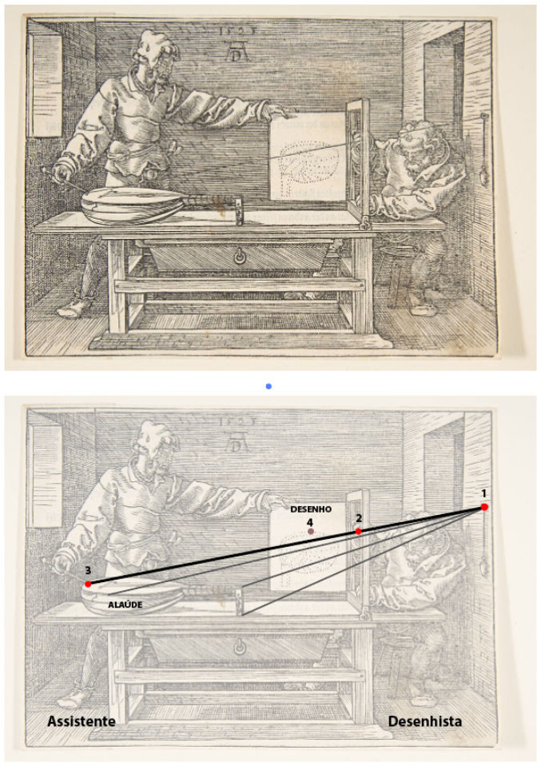
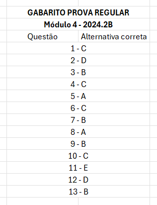

# Prova Módulo 4 (2024) - Parte 1 (Teórica)

## Questões Objetivas

### Questão 1

Uma cidade inteligente está implementando um sistema de sensores IoT para monitorar o risco ambiental em áreas urbanas. Os sensores coletam dados sobre diversos parâmetros, como qualidade do ar, nível de ruído, temperatura e umidade, enviando-os para uma plataforma central que analisa as informações, gera relatórios e emite alertas em tempo real sobre potenciais riscos ambientais, como enchentes, deslizamentos e poluição. Essa solução promete auxiliar na prevenção de desastres e na tomada de decisões para melhorar a qualidade de vida da população, mas também levanta questões éticas e sociais que demandam análise crítica.

Considerando os conhecimentos sobre relações de poder, impacto ambiental e tomada de decisões estratégicas, avalie as afirmações a seguir:

I. Os dados produzidos podem beneficiar mais empresas do que cidadãos, uma vez que elas possuem mais capacidade de tomada de decisão estratégica e influência sobre os governos.

II. A tomada de decisão sobre a implementação do sistema deve ser centralizada em um líder técnico, que possui o conhecimento adequado para definir as melhores estratégias para o monitoramento urbano.

III. A implementação da solução em IoT deve considerar as necessidades e demandas de diferentes grupos sociais, evitando que a tecnologia aprofunde desigualdades existentes no acesso à informação e aos serviços públicos.

IV. O monitoramento em tempo real da qualidade do ar pode ser utilizado para gerar mapas de poluição e identificar áreas com maior risco para a saúde pública, auxiliando na definição de políticas públicas de controle da emissão de poluentes.

É correto o que se afirma em:

A) I, II e III, apenas.  
B) I, II e IV, apenas.  
C) I, III e IV, apenas.  
D) II, III e IV, apenas.  
E) I, II, III e IV.  

### Questão 2

Um estudante de tecnologia está avaliando o lançamento de uma solução tecnológica voltada para pequenas e médias empresas. Para isso, realizou um estudo de viabilidade financeira utilizando o método do Valor Presente Líquido (VPL). O VPL é obtido pela diferença entre o valor dos benefícios futuros de caixa (FC), descontados a uma taxa conhecida como taxa mínima de atratividade, e o valor do investimento inicial do projeto.  

Para este projeto, o valor do investimento inicial é de R$ 100.000,00, enquanto o valor presente dos benefícios futuros projetados foi calculado em R$ 90.000,00. Com base nessas informações, você acha que o estudante deve seguir com o projeto? 

Assinale a alternativa correta.

A) Sim, pois o VPL é positivo, dado por R$100.000,00  
B) Sim, pois o VPL é positivo, dado por R$190.000,00  
C) Sim, pois o VPL é positivo, dado por R$10.000,00  
D) Não, pois o VPL é negativo, dado por -R$10.000,00  
E) Não, pois o VPL é negativo, dado por -R$90.000,00  

### Questão 3

Uma empresa de tecnologia desenvolve e comercializa dispositivos de automação residencial, como interruptores inteligentes e sensores de presença.

Recentemente, a empresa está avaliando o preço de venda de um novo produto, um "Hub Inteligente" que conecta todos os dispositivos da casa.

Os custos e despesas variáveis associados à produção e venda de cada unidade do "Hub Inteligente" são os seguintes:

Custo variável por unidade (produção): R$ 120,00
Despesa variável por unidade (marketing e distribuição): R$ 30,00

A empresa deseja atingir uma margem de contribuição de 40% sobre o preço de venda do produto. Sabendo disso, qual deve ser o preço de venda mínimo por unidade do "Hub Inteligente" para atingir a margem de contribuição desejada?

A) R$ 200,00  
B) R$ 250,00  
C) R$ 300,00      
D) R$ 350,00  
E) R$ 400,00  

### Questão 4

A Computação em Nuvem tem transformado a forma como as empresas gerenciam suas operações e recursos tecnológicos, especialmente na era da Indústria 4.0. Ela oferece serviços de computação, como infraestrutura, plataformas e aplicações, acessíveis pela internet, permitindo que as empresas escalem suas operações de maneira eficiente. 

Com base no documento, qual é uma das principais vantagens da Computação em Nuvem para as empresas nesse contexto?

A) Aumento da velocidade de processamento de dados, devido ao incremento na capacidade computacional.  
B) Aumento da precisão dos modelos preditivos, devido a uma maior utilização de algoritmos.  
C) Escalabilidade a custos reduzidos, pagando apenas pelo que é utilizado.  
D) Fim da redundância dos sistemas.  
E) Facilidade em acessar dados sigilosos devido à alta conectividade.  

### Questão 5

Na figura a seguir é reproduzido O Desenhista do Alaúde, s/d, do pintor e desenhista alemão Albrecht Dürer (1471–1528). Uma impressão dessa xilogravura (gravura em madeira, 13 x 18,2 cm) integra a coleção do Metropolitan Museum of Art, em Nova York.

A obra retrata um instrumento mecânico utilizado para auxiliar desenhistas na aplicação de técnicas de projeção, permitindo a representação de um objeto tridimensional em uma superfície bidimensional com precisão. Tais técnicas de desenho foram especialmente úteis para o desenvolvimento artístico e científico do Renascimento, promovendo avanços na representação de formas e proporções, fundamentos que mais tarde seriam utilizados nas disciplinas de desenho técnico nas engenharias.

Na cena retratada por Dürer, há uma corda presa no ponto 1. O assistente estica essa corda, passando pelo ponto 2 e chegando ao ponto 3, onde encosta no instrumento alaúde. O ponto 2, localizado dentro de um quadro, é marcado pelo desenhista e, em seguida, transferido para um plano de desenho, sendo representado como o ponto 4.

Considerando o conteúdo estudado sobre projeções e vistas, assinale a alternativa que melhor descreve o tipo de desenho resultante dessa técnica de projeção.

 

 
    

 

A) O alaúde desenhado será representado com uma projeção perspectiva, pois utiliza pontos de fuga (ponto 1) para simular a visão humana, criando uma representação tridimensional que pode causar distorções visuais para aumentar o realismo.  
B) O alaúde desenhado será representado com uma projeção isométrica, na qual os pontos 1, 2 e 3 são usados para criar uma profundidade realista, com linhas divergentes que simulam o olhar humano, mas mantém as medidas precisamente retratadas.  
C) O alaúde desenhado será representado com uma projeção ortográfica, já que o mecanismo utiliza linhas inclinadas (como a ligação entre os pontos 1 e 3) para mostrar a profundidade do objeto com medidas precisas.  
D) O alaúde desenhado será representado com uma projeção multivista, na qual o objeto é representado por vistas planas (frontal, lateral e superior), sem linhas convergentes ou distorções, o que garante medidas precisas na ilustração.  
E) O alaúde desenhado será representado com uma projeção perspectiva, onde todas as linhas (como as ligadas aos pontos 2 e 4) permanecem paralelas, criando uma representação proporcional e sem distorções.  

### Questão 6

Uma equipe de design está desenvolvendo um sistema IoT para monitoramento de energia residencial. O sistema integra dispositivos como medidores inteligentes, sensores de consumo e um aplicativo móvel que permite aos usuários acompanhar o uso de energia em tempo real.

Durante o processo de design, foram identificados três desafios principais:

- Assegurar que cada dispositivo do sistema tenha uma função bem definida e contribua de forma complementar;

- Garantir que os padrões e terminologias usados nos dispositivos sejam consistentes, facilitando a interação;

- Proporcionar uma experiência fluida ao alternar entre diferentes dispositivos e plataformas.

Para resolver esses desafios, a equipe aplicou os conceitos discutidos no autoestudo sobre usabilidade e design de interação em IoT. Complete as lacunas com os princípios que melhor descrevem as soluções aplicadas:

1. A ___________ organiza como as funcionalidades são distribuídas entre os dispositivos, maximizando a eficiência do sistema.

2. A ___________ assegura que os elementos do sistema sigam padrões uniformes, promovendo uma experiência coesa.

3. A ___________ possibilita que as transições entre dispositivos e plataformas sejam feitas sem interrupções, garantindo fluidez na experiência do usuário.

Assinale a alternativa que associa corretamente os princípios.

A) 1) Consistência, 2) Continuidade, 3) Composição.  
B) 1) Continuidade, 2) Composição, 3) Consistência.  
C) 1) Composição, 2) Consistência, 3) Continuidade.  
D) 1) Consistência, 2) Composição, 3) Continuidade.  
E) 1) Continuidade, 2) Consistência, 3) Composição.  

### Questão 7

Uma empresa de tecnologia especializada em automação residencial está desenvolvendo um sistema de controle inteligente para regular o consumo de energia elétrica com base em dados de sensores digitais distribuídos em toda a casa. Esses sensores medem informações como temperatura ambiente, presença de movimento e níveis de luminosidade, transmitindo os dados para um controlador central que ajusta os sistemas de iluminação, aquecimento e resfriamento automaticamente. A equipe de desenvolvimento está utilizando ponteiros na programação para acessar e manipular as informações recebidas dos sensores com eficiência.

Considere as seguintes afirmações sobre o uso de ponteiros e sensores digitais nesse contexto:

I. Os ponteiros permitem acessar diretamente a memória onde os dados dos sensores digitais estão armazenados, o que pode melhorar a eficiência do sistema ao reduzir a cópia de dados.

II. Sensores digitais fornecem dados em formato binário (1 ou 0), o que facilita a leitura e o processamento direto pelo controlador central sem a necessidade de conversão adicional.

III. Ao manipular ponteiros de forma inadequada, há risco de acessar posições de memória não autorizadas, o que pode comprometer a segurança do sistema de automação.

IV. Sensores digitais são ideais para medições contínuas, pois fornecem valores variáveis em uma faixa contínua, possibilitando leituras precisas de temperatura, luminosidade e movimento.

Estão corretas as afirmações:

A) I e II, apenas.  
B) I, II e III, apenas.  
C) II e IV, apenas.  
D) III e IV, apenas.  
E) I, II, III e IV.  

### Questão 8

Um grupo de alunos do Inteli faz parte de uma startup de IoT no Brasil do ramo do agronegócio, cujo objetivo é aumentar a produtividade das fazendas usando sensores e dispositivos conectados que permitem monitorar em tempo real variáveis como temperatura, movimento mecânico de máquinas, condições climáticas e saúde dos cultivos e árvores, ajudando a otimizar o uso de recursos e a melhorar a produtividade. 

E para que esse serviço de IoT esteja disponível nas propriedades rurais do Brasil, adotou-se a conexão 5G de celular como a infraestrutura oficial de Internet. 

Com base nessas definições, julgue cada afirmação em verdadeira ou falsa.

I) Numa arquitetura IoT, o broker usado no protocolo MQTT atua como um cliente que apenas envia dados diretamente para outros clientes na rede que assinam um tópico;

II) O broker MQTT filtra e distribui mensagens publicadas para os clientes inscritos nos tópicos correspondentes;

III) Uma conexão de Internet bem sucedida é devido à sua baixa latência, essencial para o envio rápido de dados em tempo real dos sensores para o broker MQTT;

IV) Fazendo um comparativo da potência do sinal WiFi do Inteli, para garantir o funcionamento adequado do sistema IoT, é necessário que o sinal 5G tenha uma intensidade mínima de -40 dBm nas áreas onde os sensores estão instalados.
Sobre essas afirmações:
 
A) Somente I é falsa;  
B) Somente I e II são falsas;  
C) Somente II e III são falsas;  
D) Somente III e IV são falsas;  
E) Somente IV é falsa.  

### Questão 9

Depois de construir um pequeno sistema elétrico, um aluno estava percebendo inconsistências em alguns procedimentos e resolveu investigar. Seu professor comentou que, possivelmente, era um problema de bouncing. O aluno, desconhecendo do que se tratava, resolveu pesquisar e levou ao professor um resumo do que havia aprendido para que fosse validado, conforme consta nas alternativas abaixo. De todas as afirmações, apenas uma estava INCORRETA. Qual? 

A) O efeito Bouncing ocorre devido a vibrações mecânicas no contato de botões ou chaves, gerando múltiplos pulsos elétricos ao invés de um único, o que pode causar leituras incorretas em sistemas digitais.  
B) O uso de um capacitor ou circuito RC elimina a necessidade de implementar soluções via software para o efeito Bouncing.  
C) Um capacitor pode ser usado como solução de hardware para o Bouncing, pois ele suaviza as variações rápidas no sinal ao carregar e descarregar, funcionando como um filtro de ruído.  
D) O uso de um circuito RC (Resistor-Capacitor) é uma solução de hardware eficiente para eliminar o Bouncing, pois cria um atraso controlado na resposta elétrica que filtra os pulsos indesejados.  
E) Em soluções via software, uma rotina baseada na função millis() pode ser usada para implementar um debounce, ignorando múltiplas leituras dentro de um intervalo de tempo especificado.  

### Questão 10

Imagine uma fábrica onde robôs ajustam peças em esteiras automaticamente, motores controlam a velocidade das máquinas de acordo com a demanda, e braços mecânicos pausam suas operações ao detectar uma obstrução. Por trás dessas funcionalidades estão os atuadores, dispositivos que realizam ações físicas, como movimentar, ligar, desligar ou ajustar equipamentos, com base em comandos enviados por controladores ou aplicativos. Neste contexto, considere as seguintes afirmativas sobre a implementação de atuadores em um sistema de automação residencial:

I. Atuadores podem trabalhar independentemente de uma rede Wi-Fi.  

II. Atuadores hidráulicos transformam energia mecânica em energia hidráulica.

III. Um atuador pode ser acionado por um aplicativo móvel.

IV. O disparo de um atuador pode ser implementado com um módulo relé composto por bobina, armadura e contatos.

Assinale quais das afirmativas acima estão corretas:
 
A) Somente I e III.  
B) Somente II e IV.  
C) Somente I, III e IV.  
D) Somente I, II e III.  
E) Todas as afirmações estão corretas.  

### Questão 11

[Clique aqui para abrir a questão 11](questoes-matematica/Q11.pdf) em formato .pdf e em seguida selecione a opção correta abaixo. 

A) Alternativa A.  
B) Alternativa B.  
C) Alternativa C.  
D) Alternativa D.  
E) Alternativa E.  

### Questão 12

[Clique aqui para abrir a questão 12](questoes-matematica/Q12.pdf) em formato .pdf e em seguida selecione a opção correta abaixo. 

A) Alternativa A.  
B) Alternativa B.  
C) Alternativa C.  
D) Alternativa D.  
E) Alternativa E.  

### Questão 13

[Clique aqui para abrir a questão 13](questoes-matematica/Q13.pdf) em formato .pdf e em seguida selecione a opção correta abaixo. 

A) Alternativa A.  
B) Alternativa B.  
C) Alternativa C.  
D) Alternativa D.  
E) Alternativa E.  

## Questões Dissertativas

### Questão 14

[Clique aqui para abrir a questão 14](questoes-matematica/Q14.pdf) em formato .pdf e em seguida escreva a sua resposta no campo a seguir. Apresente a resolução passo a passo e não apenas a resposta final.

### Questão 15

[Clique aqui para abrir a questão 15](questoes-matematica/Q15.pdf) em formato .pdf e em seguida escreva a sua resposta no campo a seguir. Apresente a resolução passo a passo e não apenas a resposta final.

## Gabarito

 

 
    

 
